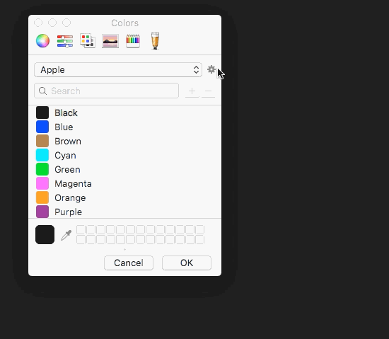
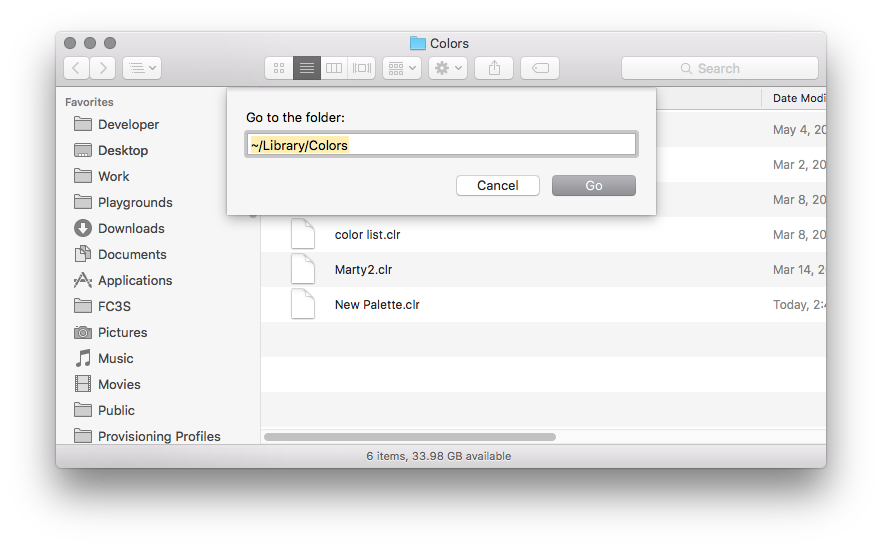

# Color Management

## Creating a Color Palette

Open the color picker [with this app](Color Picker.app).

Create a new palette



Find the new palette in `~/Library/Colors`



Copy and/or share the `.clr` file. The receiving user will need to add it to their `~/Library/Colors` directory, which may need to be created if it does not exist.

The receiving user may need to restart any applications(eg. Xcode) that were running when they added the palette for it to show up initially.

## iOS

### Base Colors

```
public struct Colors {
    public static let blue1 = UIColor(red: 0.0, green: 0.0, blue: 1.0, alpha: 1.0)
    public static let blue2 = UIColor(red: 0.0, green: 0.4, blue: 1.0, alpha: 1.0)
    public static let blue3 = UIColor(red: 0.1, green: 0.0, blue: 1.0, alpha: 1.0)
    public static let blue4 = UIColor(red: 0.2, green: 0.2, blue: 1.0, alpha: 1.0)
}
```

### Semantic Names

```
extension Colors {
    public static var navbarBlue: UIColor { return Colors.blue1 }
    public static var subnavBlue: UIColor { return Colors.blue3 }
}
```

### Example Usage

```
view.backgroundColor = Colors.navbarBlue
```

### Class specific colors

```
@IBDesignable class SomeView: UIView {
...
    struct Colors {
        static let foregroundBlue = SomeProject.Colors.blue2
    }
...
}
```