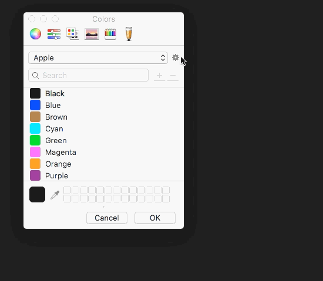
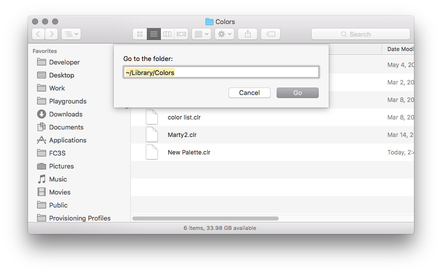

# Color Management

## Creating a Color Palette

Open the color picker [with this app](Color Picker.app).

Create a new palette



Find the new palette in `~/Library/Colors`



Copy and/or share the `.clr` file. The receiving user will need to add it to their `~/Library/Colors` directory, which may need to be created if it does not exist.

The receiving user may need to restart any applications(eg. Xcode) that were running when they added the palette for it to show up initially.

## Color Class Usage

### Base Colors

```
public struct Palette {

    //MARK: - Blues

    public static let Blue1: Color = "#0E7FF9"
    public static let Blue2: Color = "#006BB6"
    public static let Blue3: Color = "#002F50"
    public static let Blue4: Color = "#072840"
    public static let Blue5: Color = "#051c2D"

    //MARK: - Greys

    public static let Grey1: Color = "#66737C"
    public static let Grey2: Color = "#CCD0D3"
    public static let Grey3: Color = "#E6E8EA"
    public static let Grey4: Color = "#F3F4F5"

    //MARK: - Reds

    public static let Red1: Color = "#E11647"

    //MARK: - Whites

    public static let White1: Color = "#FFFFFF"
}
```

### Semantic Names

```
public extension Palette {
    public static let navbarBlue = Palette.Blue1
}
```

### Example Usage

```
view.backgroundColor = Colors.navbarBlue
```

### Class specific colors

```
@IBDesignable class SomeView: UIView {
...
    struct Colors {
        static let foregroundBlue = SomeProject.Colors.blue2
    }
...
}
```